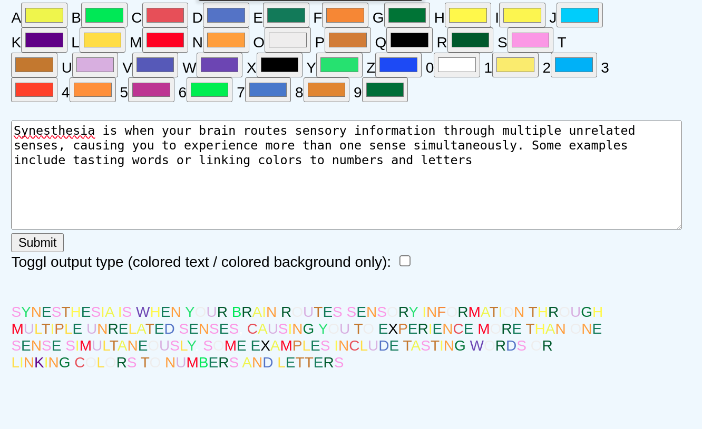
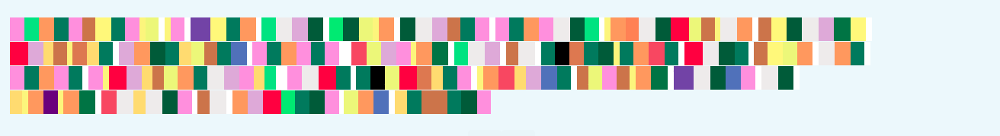

# Synesthesia for text and color

My partner has synesthesia so I created this program that allows you to pick the exact colour (or two) for each letter in the alphabet and digit. It allows you to do the following:
1) Pick the exact colour that your brain ties to each letter and digit
2) Display any text in this coloring 
3) Or display any text fully with recangles that are colored accordingly

#### The secondary display option replaces each letter/digit with a rectangle of the color chosen before:
Here is an example output:

## Installation and running
1. Clone the repository and run the `run.sh`. or simply rin `python3 app.py`
2. Go to http://127.0.0.1:5000/ 
3. Pick the colors for each letter
4. Put in text into the field and click submit
5. You can use the toggle outptut checkbox to switch between the display sytels

### Here's the general structure of the project:

- `app.py`: The main Python script that runs the Flask server.
- `templates/`: A directory that contains the HTML templates.
  - `index.html`: The main webpage that displays the alphabet and digits, and allows the user to pick colors.
- `static/`: A directory that contains static files like CSS and JavaScript.
  - `styles.css`: The CSS file that styles the webpage.
  - `main.js`: The JavaScript file that handles the interactive elements of the webpage.
- `requirements.txt`: The file that lists the Python dependencies for the project.

---
*Tip: It makes it easier and nicer to use to zoom in the website to 125% for higher resultion screens.*